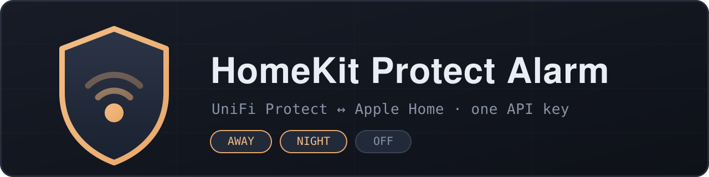

<p align="center">
  
</p>

<p align="center">
  <a href="LICENSE"></a>
  
  
</p>

# HomeKit Protect Alarm

Bring your **UniFi Protect alarm system** into Apple HomeKit as a native
Security System tile — arm and disarm from the Home app, Control Center,
automations, or Siri.

> "Hey Siri, set the security system to Away."

Authentication uses a **single UniFi OS API key**. No UniFi username or
password is stored in your Homebridge config, no session cookies, no CSRF
juggling — one key does everything.

## Features

- 🛡️ **Native HomeKit Security System** accessory — Away / Night / Off
- 🚨 **Alarm-triggered state** — when Protect's alarm fires, HomeKit enters the
  triggered state so you get a notification and can drive automations
- 🔑 **One API key** — generated in UniFi OS, pasted once
- 🔎 **Automatic arm-profile discovery** — profiles are matched by name, so you
  never hunt for internal IDs
- 🔁 **Two-way sync** — arming from a keyfob, the Protect app, or a UniFi
  automation is reflected back in HomeKit within seconds, including *which*
  mode (Away vs Night)
- ⏱️ **Countdown-aware** — an exit delay ("arming") is shown as armed so
  HomeKit doesn't snap back to Off mid-countdown
- 🪶 **Tiny** — one file, one dependency

## How HomeKit states map

| HomeKit | UniFi Protect action |
|---|---|
| **Away** | Activate your *Away* arm profile (exit delays respected) |
| **Night** | Activate your *Night* arm profile |
| **Home** | Disarm (Protect's alarm is one system, not zones) |
| **Off** | Disarm |
| **Triggered** | Reported when Protect's alarm fires — see below |

## Alarm-triggered (breach) monitoring

The plugin also reports when the alarm actually **goes off**. Protect's
`armMode.status` becomes `breach` during an active alarm; this is mapped to
HomeKit's *Alarm Triggered* state, so the Home app notifies you and automations
can react — without needing direct Protect access.

While triggered, the tile's target mode keeps showing the armed profile
(Away / Night) rather than switching, and it returns to the armed state
automatically when the breach clears (or Disarmed if the system is disabled). A
breach spanning several polls fires once, not on every poll, and is logged at
info level with the Protect event ID for correlation.

To detect an alarm quickly without polling hard while disarmed, an extra poll
interval kicks in only while armed:

| Field | Default | Description |
|---|---|---|
| `pollIntervalWhenArmed` | `2` | Seconds between polls while armed or arming (the only window a breach can occur) |

> **Note:** whether Protect clears `breach` back to `armed` on its own after the
> alarm duration, or holds it until you disarm, has not been confirmed on live
> hardware. The plugin handles both and never depends on a manual disarm to
> recover.

## Requirements

- A UniFi OS console running **UniFi Protect** with the alarm system set up
  (UDM, UDM Pro / SE, Cloud Key Gen2+, UNVR…)
- At least one **arm profile** configured in Protect (e.g. *Away*, *Night*)
- **Homebridge ≥ 1.6** on **Node ≥ 18**

## Installation

This fork isn't published to npm. Install it straight from GitHub:

```bash
npm install -g hymond/homebridge-protect-alarm
```

Or clone and install from a local checkout:

```bash
git clone https://github.com/hymond/homebridge-protect-alarm.git
npm install -g ./homebridge-protect-alarm
```

Then restart Homebridge. It registers the same `ProtectAlarm` platform as
upstream, so an existing config block keeps working unchanged.

## Setup

### 1. Generate an API key

1. Open your UniFi OS console in a browser
2. **Settings → Control Plane → Integrations**
3. **Create API Key**, give it a name like `homebridge`, and copy it —
   it is shown only once

### 2. Configure the plugin

Use the settings form in the Homebridge UI, or add this to `config.json`:

```json
{
  "platforms": [
    {
      "platform": "ProtectAlarm",
      "name": "Security System",
      "controller": "192.168.1.1",
      "apiKey": "PASTE_YOUR_KEY"
    }
  ]
}
```

That is the **entire** minimum configuration. On startup the plugin lists your
arm profiles and matches `Away` and `Night` by name.

### 3. Restart Homebridge

A *Security System* tile appears in the Home app. Done.

## Configuration reference

| Field | Required | Default | Description |
|---|---|---|---|
| `controller` | ✅ | — | Host/IP of your UniFi OS console (no `https://`) |
| `apiKey` | ✅ | — | UniFi OS API key |
| `name` | | `Security System` | Accessory name in HomeKit |
| `awayProfileName` | | `Away` | Arm profile used for HomeKit **Away** |
| `nightProfileName` | | `Night` | Arm profile used for HomeKit **Night** |
| `pollInterval` | | `5` | Seconds between state polls while disarmed |
| `pollIntervalWhenArmed` | | `2` | Seconds between state polls while armed or arming |
| `awayArmProfileId` | | — | Advanced: explicit ID, bypasses name matching |
| `nightArmProfileId` | | — | Advanced: explicit ID, bypasses name matching |

### My profiles aren't called "Away" and "Night"

Set `awayProfileName` / `nightProfileName` to whatever yours are called. If a
name doesn't match anything, the startup log prints the list of profiles that
actually exist on your console so you can copy the right one.

### Only one profile?

That's fine — configure the one you have. The missing mode logs an error if
selected and otherwise stays out of the way.

## Troubleshooting

| Symptom | Likely cause |
|---|---|
| `Initialization failed: HTTP 401` | API key wrong or revoked — generate a new one |
| `Away profile … NOT FOUND` | Profile name mismatch — check the startup log for available names |
| Tile stuck / not updating | Controller unreachable from the Homebridge host — test with the curl below |
| `HTTP 404` on arm/disarm | Very old Protect firmware without the integration API — update UniFi OS / Protect |

Quick connectivity test from the Homebridge host:

```bash
curl -sk -H "X-API-KEY: YOUR_KEY" \
  "https://YOUR_CONTROLLER/proxy/protect/integration/v1/arm-profiles"
```

If that prints your profiles as JSON, the plugin will work. To inspect the arm
state (including a live `breach`) directly:

```bash
curl -sk -H "X-API-KEY: YOUR_KEY" \
  "https://YOUR_CONTROLLER/proxy/protect/integration/v1/nvrs" | jq '.armMode'
```

## How it works

The plugin talks to UniFi Protect's official **integration API**
(`/proxy/protect/integration/v1/`):

- `GET /arm-profiles` — discover profiles by name at startup
- `GET /nvrs` — poll `armMode.status` and the active profile
- `PATCH /arm-profiles/settings` + `POST /arm-profiles/enable` — arm
- `POST /arm-profiles/disable` — disarm

`arming` (exit-delay countdown) is intentionally treated as armed so the
HomeKit tile doesn't flicker back to Off while the countdown runs.

## Contributing

Issues and PRs welcome — see [CONTRIBUTING.md](CONTRIBUTING.md). If something
doesn't work on your console, include your UniFi OS / Protect versions and the
startup log (redact your key).

## License

[MIT](LICENSE)

## Disclaimer

This project is not affiliated with or endorsed by Ubiquiti Inc. or Apple Inc.
*UniFi* and *UniFi Protect* are trademarks of Ubiquiti Inc.; *HomeKit* is a
trademark of Apple Inc. This software controls a real security system — use at
your own risk.
